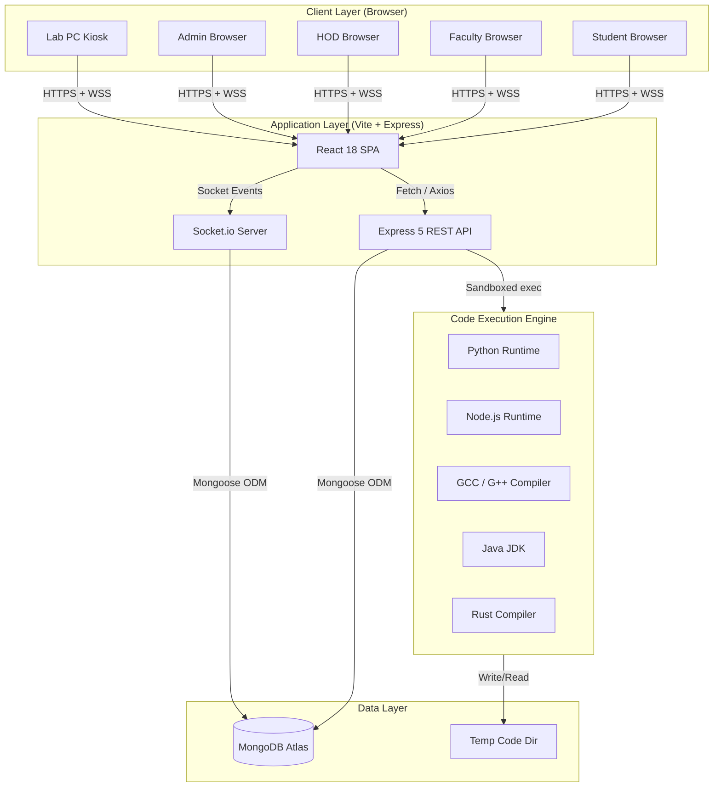
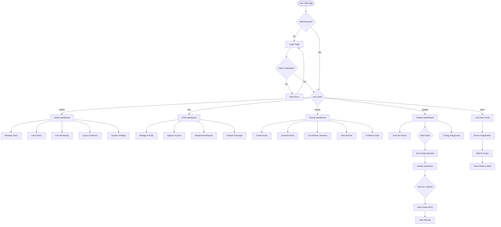
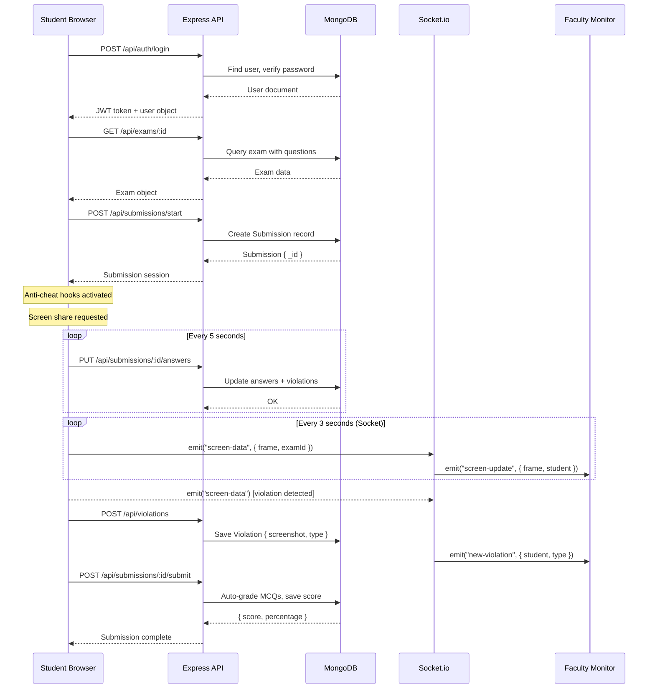
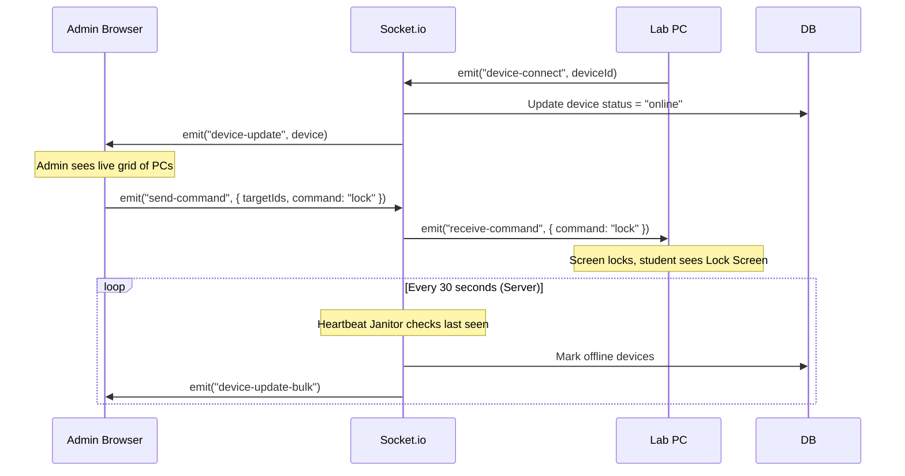
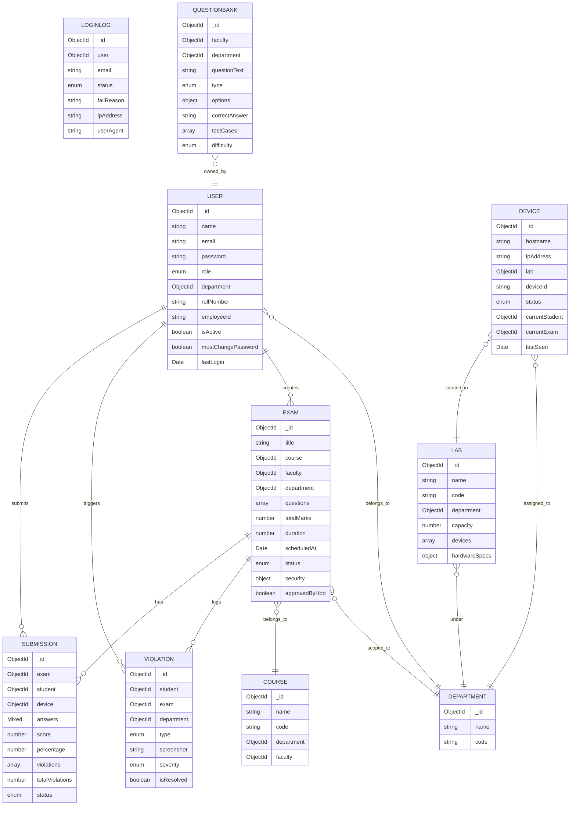
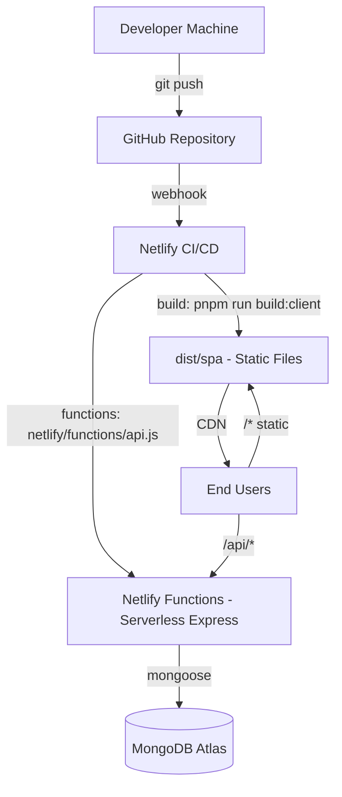
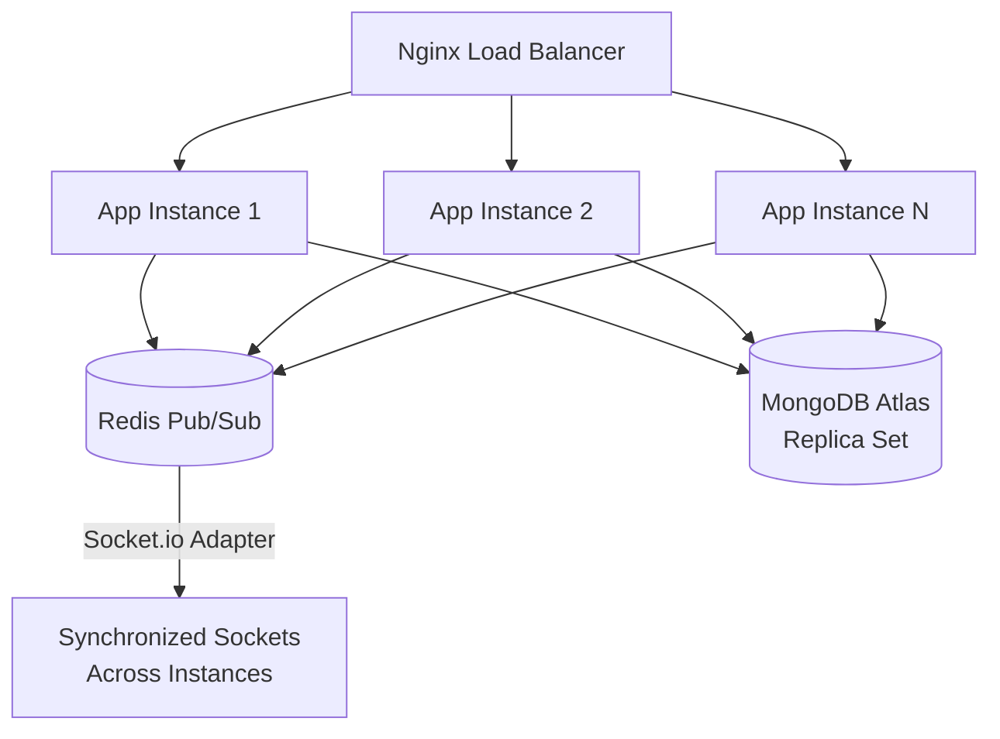

<
- [System Architecture](#-system-architecture)
- [Application Flow](#-application-flow)
- [Sequence Diagram](#-sequence-diagram)
- [Module Breakdown](#-module-breakdown)
- [Features](#-features)
- [Tech Stack](#-tech-stack-detailed)
- [Project Structure](#-project-structure)
- [Installation & Setup](#-installation--setup)
- [Security & Anti-Cheat](#-security--anti-cheat-system)
- [API Design](#-api-design)
- [Database Design](#-database-design)
- [DevOps & Deployment](#-devops--deployment)
- [Scalability & Performance](#-scalability--performance)
- [Use Cases](#-use-cases)
- [Project Optimization](#-project-optimization-suggestions)
- [Screenshots](#-screenshots)
- [Contributing](#-contributing)
- [License](#-license)

---

## 🔍 Overview

**NEC LMS** solves a critical problem facing engineering colleges: **conducting fair, scalable, and monitored online examinations** without expensive third-party proctoring software.

### The Problem
- Paper exams are slow to grade and easy to cheat on
- Generic platforms (Google Forms, etc.) have zero security
- Enterprise proctoring tools (ExamSoft, ProctorU) are prohibitively expensive
- Colleges lack a unified system for faculty, HODs, and admins to collaborate

### The Solution
NEC LMS provides a **self-hosted, full-stack examination ecosystem** where:
- Admins manage labs and hardware nodes in real time
- HODs oversee department-level exam governance and approvals
- Faculty design multi-type exams and monitor students **live**
- Students take secure, timed exams in a locked-down browser environment
- Lab PCs run as **dedicated client kiosks** linked to the server

### Target Users
| Role | Who They Are |
|------|-------------|
| **Admin** | IT administrator managing the entire institution |
| **HOD** | Head of Department — approves exams, manages faculty |
| **Faculty** | Professors/lecturers — create exams, monitor, grade |
| **Student** | Enrolled students taking exams |
| **Client** | Lab PC running in kiosk/exam mode |

---

## 🧠 System Architecture

### Architecture Diagram



### Architecture Pattern
**Modular Monolith** — single deployable unit with clean module boundaries. Backend is a single Express app; frontend is a single React SPA. Both share one server process in development via a Vite plugin, and are deployed as separate build artifacts in production.

### Data Flow
1. Client sends HTTP requests or Socket.io events to the Express API
2. API authenticates via JWT middleware → delegates to route handlers
3. Route handlers query MongoDB via Mongoose models
4. For code execution: code is written to a temp file → compiled/executed in a sandboxed subprocess → output returned → file cleaned up
5. Real-time events (violations, screen frames, device heartbeats) flow over Socket.io rooms

---

## 🔄 Application Flow

### Main Application Flowchart



---

## 🔁 Sequence Diagram

### Student Exam Session



### Admin Lab Control



---

## 🧩 Module Breakdown

### Admin Module
| Component | Purpose |
|-----------|---------|
| `Dashboard.jsx` | Real-time KPI cards, activity feed, violation panel, live device grid |
| `UserList / AddUser / BulkUpload` | Full user CRUD with CSV bulk import |
| `DeviceList / RegisterDevice` | Manage and register lab hardware nodes |
| `LabControl` | Remote commands (lock/unlock/restart) to lab PCs |
| `LiveMonitoring` | Real-time student screen grid during exams |
| `LoginLogs / ActivityLogs / Violations` | Complete audit trail |
| `SystemSettings / SecurityPolicies` | Platform-wide configuration |

### HOD Module
| Component | Purpose |
|-----------|---------|
| `Dashboard.jsx` | Department stats, faculty status, alerts |
| `FacultyManagement` | Create/manage faculty, bulk onboarding |
| `StudentManagement` | Oversee students in department |
| `Exams` | Approve/create exams with HOD authority |
| `Monitoring` | Watch live exams in the department |
| `Reports` | Analytics, performance charts |

### Faculty Module
| Component | Purpose |
|-----------|---------|
| `Dashboard.jsx` | Exam stats, recent activity |
| `CreateExam` | Multi-type exam builder (MCQ, Text, Coding, Math) |
| `QuestionBank` | Reusable question repository |
| `Monitoring` | Live student screen monitoring per exam |
| `Results` | Grade submissions, export results |
| `Violations` | Review flagged students |
| `EvidenceVault / Evidence` | Screenshot evidence with severity levels |

### Student Module
| Component | Purpose |
|-----------|---------|
| `Dashboard.jsx` | Upcoming exams, grades, stats |
| `MyExams` | List of assigned/scheduled exams |
| `ExamInterface` | Full secured exam engine with anti-cheat, timer, coding IDE |
| `Results` | View scores, percentages, feedback |
| `CodingPlayground` | Practice coding environment |

### Client Module (Lab PC Kiosk)
| Component | Purpose |
|-----------|---------|
| `WaitingScreen` | Waiting for exam to start |
| `ExamMode` | Locked exam interface |
| `LockScreen` | Triggered by admin lock command |
| `ViolationScreen` | Shown when max violations exceeded |

### API Layer
| Route Group | Endpoints |
|------------|-----------|
| Auth | Login, logout |
| Users | CRUD + bulk upload |
| Exams | Create, schedule, manage |
| Submissions | Start, update answers, submit |
| Questions | Question bank CRUD |
| Violations | Log, fetch, resolve |
| Devices | Register, heartbeat, status |
| Lab | Remote commands |
| Reports | System/faculty/student stats |
| HOD | Department-specific analytics |
| Logs | Login logs, activity logs |
| Code | Execute + check compilers |
| Settings | Platform configuration |

---

## ✨ Features

### Authentication & Access Control
- JWT-based stateless authentication (24h expiry)
- Session stored in `sessionStorage` (auto-cleared on tab close)
- 5-role RBAC: `admin`, `hod`, `faculty`, `student`, `client`
- Password hashing with bcrypt (12 salt rounds)
- Login failure logging with IP + user-agent capture
- `mustChangePassword` flag for first-time logins

### Exam Engine
- **Question types**: MCQ, Text (short/long), Coding, Math, File upload
- **Configurable security per exam**: max violations, copy-paste block, tab detection, DevTools detection, fullscreen enforcement
- **Auto-grading**: MCQ answers checked server-side on submit
- **HOD approval workflow**: exams require HOD sign-off before going live
- **Exam lifecycle**: `draft → scheduled → active → completed → cancelled`
- **Time management**: Countdown timer, auto-submit on timeout
- **Answer persistence**: localStorage backup + cloud sync every 5 seconds
- **Question flagging**: Students can mark questions for review

### Live Proctoring Engine
- Real-time screen capture via `getDisplayMedia()` API
- Rate-limited socket broadcast (1 frame per 2.5 seconds) to prevent congestion
- Faculty sees a live grid of all student screens during an exam
- Violation screenshots captured in-browser at 640×360 (JPEG 40% quality)
- Periodic snapshots every 10 seconds for evidence records
- Socket.io rooms scoped per exam (`monitoring-{examId}`)

### Anti-Cheat System
| Violation Type | Detection Method |
|----------------|-----------------|
| `switched_tab` | `visibilitychange` event |
| `copy_paste` | `copy` / `paste` event listeners |
| `tools_open` | Window size comparison (outerWidth vs innerWidth) |
| `screen_share_stopped` | `videoTrack.onended` callback |
| `screen_share_denied` | `getDisplayMedia` catch block |
| `periodic_snapshot` | Scheduled screenshots stored as evidence |

### Integrated Code Execution Engine
- Supports: **Python, JavaScript, Node.js, C, C++, Java, Rust, Bash**
- Each run uses a UUID-based temp file → isolated execution → automatic cleanup
- 5-second execution timeout enforced
- Compilation errors returned as structured error messages
- MinGW path injection for Windows GCC/G++ support
- Monaco Editor (offline-capable, bundled in `public/monaco/`)

### Lab Hardware Management
- Register physical lab PCs with hostname, IP, MAC, location, and department
- Real-time device status: `online | offline | exam | locked | maintenance`
- Heartbeat janitor runs every 30 seconds server-side to mark stale devices
- Admin can broadcast remote commands (`lock`, `unlock`, etc.) to individual or all devices
- Current student + current exam tracked per device

### Question Bank
- Faculty-owned question repository across courses
- Filter by difficulty (`easy`, `medium`, `hard`) and topic
- Supports test cases for coding questions
- Reusable across multiple exams

### Reporting & Analytics
- Admin: system-wide user counts, device stats, active exams
- HOD: department analytics, faculty performance status
- Faculty: per-exam results, submission counts, violation rates
- Student: personal scores, percentages, exam history

---

## 🧰 Tech Stack (Detailed)

### Frontend

| Technology | Version | Role in Project |
|-----------|---------|----------------|
| **React** | 18.3 | UI rendering with hooks, lazy loading per route |
| **Vite** | 8.x | Dev server + bundler; also injects Express via custom plugin |
| **React Router** | 6.30 | Client-side routing with `lazy()` code splitting |
| **TailwindCSS** | 3.4 | Utility-first styling; dark/light theme via CSS variables |
| **shadcn/ui + Radix UI** | Latest | Accessible, unstyled component primitives (Dialog, Toast, etc.) |
| **TanStack Query** | 5.x | Server state management, caching, background refetching |
| **Socket.io-client** | 4.8 | Bidirectional real-time events (screen streaming, violations) |
| **Monaco Editor** | 0.55 | VS Code's editor embedded for the coding exam interface |
| **Lucide React** | 0.539 | Icon library |
| **Framer Motion** | 12.x | Animations |
| **Recharts** | 2.12 | Analytics charts on dashboards |
| **date-fns** | 4.x | Date formatting |

### Backend

| Technology | Version | Role in Project |
|-----------|---------|----------------|
| **Node.js** | 20+ | JavaScript runtime |
| **Express** | 5.x | HTTP server, middleware pipeline, REST API |
| **Mongoose** | 9.4 | MongoDB ODM with schema validation and indexing |
| **Socket.io** | 4.8 | WebSocket server for real-time events |
| **jsonwebtoken** | 9.x | JWT generation and verification |
| **bcryptjs** | 3.x | Password hashing (12 salt rounds) |
| **dotenv** | 17.x | Environment variable loading |
| **uuid** | 13.x | UUID generation for code execution session IDs |

### Database

| Technology | Role |
|-----------|------|
| **MongoDB Atlas** | Primary database — document store for all entities |
| **Mongoose Indexes** | Compound indexes on hot query paths (role+dept, exam+status, etc.) |

### DevOps & Tooling

| Tool | Role |
|------|------|
| **pnpm** | Fast, disk-efficient package manager |
| **Vite build** | Dual build: `dist/spa/` (React) + `dist/server/` (Express) |
| **Netlify** | Frontend hosting + serverless functions for API |
| **netlify/functions/api.js** | Express wrapped with `serverless-http` for Netlify |
| **Prettier** | Code formatting |
| **Vitest** | Unit testing |

---

## 📂 Project Structure

```
NEClms/
│
├── client/                          # React Frontend (SPA)
│   ├── App.jsx                      # Root — providers, auth guard
│   ├── global.css                   # Tailwind directives + CSS variables
│   │
│   ├── components/                  # Generic UI components
│   │   ├── ui/                      # shadcn/ui primitives (Button, Dialog, etc.)
│   │   ├── DashboardLayout.jsx      # Shared sidebar + navbar shell
│   │   ├── ErrorBoundary.jsx        # React error boundary
│   │   └── ProtectedRoute.jsx       # Auth + role guard wrapper
│   │
│   ├── contexts/                    # React Context providers
│   │   ├── AuthContext.jsx          # Login/logout, JWT, user state
│   │   ├── SocketContext.jsx        # Socket.io client connection
│   │   ├── NotificationContext.jsx  # In-app notifications
│   │   └── ThemeContext.jsx         # Dark/light mode
│   │
│   ├── core/                        # Core utilities
│   │   ├── api/                     # Axios client + service layer
│   │   ├── constants/               # Routes, roles, navigation
│   │   ├── hooks/                   # useAsync, useForm, useUtils
│   │   └── utils/                   # Helper functions
│   │
│   ├── modules/                     # Feature modules (by role)
│   │   ├── admin/                   # Admin pages & components
│   │   ├── faculty/                 # Faculty pages & components
│   │   ├── hod/                     # HOD pages & components
│   │   ├── student/                 # Student pages (ExamInterface, etc.)
│   │   ├── client/                  # Lab PC kiosk pages
│   │   └── auth/                    # Login, ForgotPassword, Reset
│   │
│   ├── routes/
│   │   ├── AuthRoutes.jsx           # Unauthenticated routes
│   │   └── PrivateRoutes.jsx        # Role-guarded lazy-loaded routes
│   │
│   └── shared/                      # Cross-module shared components
│       ├── components/              # Reusable: Navbar, Sidebar, Loader...
│       │   ├── Coding/              # Offline Monaco Editor wrapper
│       │   ├── Monitoring/          # Live screen grid component
│       │   └── ...
│       └── layouts/                 # AuthLayout, MainLayout
│
├── server/                          # Express Backend
│   ├── index.js                     # createServer(), setupSocket(), connectDB()
│   ├── socket.js                    # Socket.io event handlers + broadcast helpers
│   │
│   ├── middleware/
│   │   └── auth.js                  # authMiddleware, roleMiddleware
│   │
│   ├── models/                      # Mongoose schemas
│   │   ├── User.js                  # 5-role user model with bcrypt hooks
│   │   ├── Exam.js                  # Polymorphic questions, security config
│   │   ├── Submission.js            # Answers, violations, auto-grade
│   │   ├── Violation.js             # Evidence with screenshots
│   │   ├── Device.js                # Lab hardware node tracking
│   │   ├── Lab.js                   # Lab rooms with hardware specs
│   │   ├── Department.js            # Academic departments
│   │   ├── Course.js                # Courses linked to departments
│   │   ├── QuestionBank.js          # Reusable questions
│   │   ├── LoginLog.js              # Authentication audit log
│   │   ├── ActivityLog.js           # User action audit trail
│   │   ├── Notification.js          # In-app notifications
│   │   ├── Mark.js                  # Grading records
│   │   ├── Attendance.js            # Attendance tracking
│   │   ├── LabSession.js            # Lab session tracking
│   │   ├── StudentProfile.js        # Extended student profile
│   │   └── Settings.js              # Platform configuration
│   │
│   ├── routes/                      # Route handlers (one function per route)
│   │   ├── auth.js                  # Login, logout
│   │   ├── users.js                 # User CRUD + bulk upload
│   │   ├── exams.js                 # Exam CRUD
│   │   ├── submissions.js           # Exam lifecycle (start/answer/submit)
│   │   ├── violations.js            # Violation logging + retrieval
│   │   ├── questions.js             # Question bank
│   │   ├── devices.js               # Device registration + heartbeat
│   │   ├── lab.js                   # Remote lab control commands
│   │   ├── hod.js                   # HOD analytics + management
│   │   ├── reports.js               # System/faculty/student reports
│   │   ├── logs.js                  # Login + activity logs
│   │   ├── settings.js              # Platform settings
│   │   ├── courses.js               # Course listing
│   │   ├── departments.js           # Department listing
│   │   ├── profile.js               # Profile management
│   │   └── code.js                  # Code execution endpoint
│   │
│   ├── utils/
│   │   └── codeExecutor.js          # Multi-language sandboxed execution
│   │
│   └── database_scripts/
│       ├── full_schema.sql          # SQL reference schema
│       └── full_schema.mongodb.js   # MongoDB schema reference
│
├── shared/
│   └── api.js                       # Shared API constants
│
├── netlify/
│   └── functions/api.js             # Serverless Express wrapper
│
├── scripts/                         # DB seeding & maintenance scripts
│   ├── seedAll.js
│   ├── createAdmin.js
│   ├── export_db.mjs
│   └── import_db.mjs
│
├── public/
│   └── monaco/                      # Bundled Monaco Editor (offline)
│
├── index.html                       # Vite SPA entry point
├── vite.config.js                   # Vite + Express dev integration
├── vite.config.server.js            # Server-only build config
├── tailwind.config.js               # Tailwind theme
├── netlify.toml                     # Netlify deployment config
├── package.json                     # Dependencies + scripts
└── .env                             # Environment variables (not committed)
```

---

## ⚙️ Installation & Setup

### System Requirements

| Requirement | Minimum | Recommended |
|------------|---------|-------------|
| **Node.js** | 18.x | 20.x LTS |
| **pnpm** | 8.x | 10.x |
| **MongoDB** | 6.x | 7.x Atlas |
| **RAM** | 2 GB | 4 GB |
| **OS** | Windows 10 / Ubuntu 20 / macOS 12 | Windows 11 / Ubuntu 22 |

**For code execution (optional — required for coding exam type):**
- Python 3.x
- Node.js (already required)
- GCC/G++ (MinGW on Windows, `build-essential` on Linux)
- Java JDK 17+
- Rust toolchain

---

### Step 1 — Clone the Repository

```bash
git clone https://github.com/your-username/NEClms.git
cd NEClms
```

### Step 2 — Install Dependencies

```bash
pnpm install
```

### Step 3 — Configure Environment Variables

Create a `.env` file in the project root:

```env
# ─── Server ────────────────────────────────────────────
PORT=8080
NODE_ENV=development

# ─── Database ──────────────────────────────────────────
# Local MongoDB
MONGODB_URI=mongodb://localhost:27017/neclms

# MongoDB Atlas (Cloud)
# MONGODB_URI=mongodb+srv://<username>:<password>@cluster.mongodb.net/neclms?retryWrites=true&w=majority

# ─── Authentication ─────────────────────────────────────
# IMPORTANT: Change this to a long, random, unique string in production!
JWT_SECRET=your-super-secret-jwt-key-at-least-32-chars

# ─── Optional ───────────────────────────────────────────
JWT_EXPIRE=24h
```

> **Security Note**: Never commit `.env` to version control. The fallback JWT secret in the source code is for development only and must be overridden in production.

### Step 4 — Database Setup

#### Option A: MongoDB Atlas (Cloud — Recommended)
1. Create a free cluster at [mongodb.com/atlas](https://www.mongodb.com/atlas)
2. Create a database user
3. Whitelist your IP (`0.0.0.0/0` for development)
4. Copy the connection string into `MONGODB_URI`

#### Option B: Local MongoDB
```bash
# macOS (Homebrew)
brew install mongodb-community && brew services start mongodb-community

# Ubuntu/Debian
sudo apt install mongodb && sudo systemctl start mongod

# Windows — Download from mongodb.com and run as service
```

### Step 5 — Seed the Database (Optional)

```bash
# Create the first admin user
node scripts/createAdmin.js

# Seed all demo data (students, faculty, exams)
node scripts/seedAll.js
```

### Step 6 — Start Development Server

```bash
pnpm run dev
```

The app starts at: **http://localhost:8080**

Both React frontend and Express API run in one process via the Vite Express plugin. Socket.io is also active.

---

### Run Commands

```bash
# Development (frontend + backend + sockets — one command)
pnpm run dev

# Build (both client and server)
pnpm run build

# Build client only
pnpm run build:client

# Build server only
pnpm run build:server

# Production start
pnpm start

# Run tests
pnpm test

# Format code
pnpm format.fix
```

---

### Docker Setup

```dockerfile
# Dockerfile
FROM node:20-alpine
WORKDIR /app
COPY package.json pnpm-lock.yaml ./
RUN npm install -g pnpm && pnpm install --frozen-lockfile
COPY . .
RUN pnpm run build
EXPOSE 8080
CMD ["pnpm", "start"]
```

```yaml
# docker-compose.yml
version: "3.9"
services:
  app:
    build: .
    ports:
      - "8080:8080"
    environment:
      - MONGODB_URI=mongodb://mongo:27017/neclms
      - JWT_SECRET=your-secret-here
      - NODE_ENV=production
    depends_on:
      - mongo

  mongo:
    image: mongo:7
    ports:
      - "27017:27017"
    volumes:
      - mongo_data:/data/db

volumes:
  mongo_data:
```

```bash
docker-compose up --build
```

---

## 🔐 Security & Anti-Cheat System

### Authentication Security
- JWT tokens signed with HS256, expire in 24 hours
- Passwords hashed with bcrypt at cost factor 12
- Sensitive fields stripped from API responses via `toJSON()` hook
- Login attempts logged with IP, user-agent, and failure reason
- Session stored in `sessionStorage` (cleared on browser close)

### Exam Anti-Cheat Controls

| Control | Implementation |
|---------|---------------|
| **Copy/Paste Block** | `document.addEventListener('copy'/'paste', preventDefault)` |
| **Right-Click Block** | `contextmenu` event blocked |
| **Tab Switch Detection** | `document.visibilitychange` event listener |
| **DevTools Detection** | Compares `outerWidth - innerWidth > 160px` |
| **Screen Share Enforcement** | `getDisplayMedia()` + validate `displaySurface === 'monitor'` |
| **Screen Share Stop Detection** | `videoTrack.onended` callback |
| **Text Selection Block** | CSS `user-select: none` on exam container |
| **Max Violations** | Configurable per exam; auto-terminates at threshold |

### API Security Headers
```
Cache-Control: no-store, no-cache
X-Content-Type-Options: nosniff
X-Frame-Options: DENY
X-XSS-Protection: 1; mode=block
Referrer-Policy: strict-origin-when-cross-origin
Strict-Transport-Security: max-age=31536000; includeSubDomains
```

### Role-Based Access Control

```
GET /api/logs/login     → admin only
GET /api/reports/system → admin only
POST /api/lab/control   → admin, hod, faculty
GET /api/violations     → admin, hod, faculty
GET /api/exams          → all authenticated
POST /api/submissions   → student only (via auth)
```

---

## 📡 API Design

### Base URL
- Development: `http://localhost:8080/api`
- Production (Netlify): `https://your-site.netlify.app/api`

### Authentication

```http
POST /api/auth/login
Content-Type: application/json

{
  "email": "admin@nec.edu",
  "password": "SecurePass123"
}

# Response
{
  "token": "eyJhbGciOiJIUzI1NiIs...",
  "user": {
    "id": "64abc...",
    "name": "Admin User",
    "email": "admin@nec.edu",
    "role": "admin",
    "department": null
  }
}
```

### Exam Lifecycle

```http
# 1. Start Exam Session
POST /api/submissions/start
Authorization: Bearer <token>
{ "examId": "64def..." }

# 2. Auto-save Answers
PUT /api/submissions/:id/answers
{ "answers": { "0": "A", "1": "def factorial(n)..." }, "violations": [...] }

# 3. Log a Violation (real-time alert)
POST /api/violations
{ "examId": "64def...", "type": "switched_tab", "screenshot": "data:image/jpeg;...", "severity": "medium" }

# 4. Submit
POST /api/submissions/:id/submit
{ "answers": { "0": "A", "1": "B" } }

# Response
{ "success": true, "score": 18, "percentage": 90 }
```

### Code Execution

```http
POST /api/code/run
Authorization: Bearer <token>
{
  "language": "python",
  "code": "print('Hello World')",
  "input": ""
}

# Response
{ "output": "Hello World\n", "error": null }
```

### Key Endpoints Summary

| Method | Endpoint | Role | Description |
|--------|----------|------|-------------|
| POST | `/api/auth/login` | Public | Authenticate user |
| GET | `/api/exams` | Authenticated | List exams |
| POST | `/api/hod/exams` | HOD/Faculty | Create exam |
| GET | `/api/reports/system` | Admin | System-wide stats |
| GET | `/api/hod/analytics` | HOD | Department analytics |
| GET | `/api/logs/violations` | Admin/HOD/Faculty | All violations |
| POST | `/api/devices/register` | Public | Register lab PC |
| POST | `/api/devices/heartbeat` | Public | Device keepalive |
| POST | `/api/lab/control` | Admin/HOD/Faculty | Remote commands |
| GET | `/api/code/check` | Public | Check available compilers |

---

## 🗄️ Database Design

### ER Diagram



### Key Design Decisions

| Decision | Reason |
|----------|--------|
| Questions embedded in Exam document | Eliminates join for exam start; questions rarely change after publish |
| Answers stored as `Mixed` type | Supports MCQ (string), text (string), coding (string), and future types |
| Violations in both Submission and Violation collections | Submission violations are lightweight event logs; Violation collection stores full evidence with screenshots |
| Compound indexes on `(exam, status)`, `(student)` | Hot paths for monitoring dashboard queries |
| Sparse indexes on `rollNumber` and `employeeId` | Allows unique constraint without requiring both fields |

---

## 🚀 DevOps & Deployment

### Deployment Architecture



### Netlify Configuration

```toml
# netlify.toml
[build]
command = "npm run build:client"
functions = "netlify/functions"
publish = "dist/spa"

[functions]
external_node_modules = ["express"]
node_bundler = "esbuild"

[[redirects]]
from = "/api/*"
to = "/.netlify/functions/api/:splat"
status = 200
force = true
```

### Self-Hosted Production Deployment

```bash
# 1. Build
pnpm run build

# 2. Set environment variables
export MONGODB_URI="mongodb+srv://..."
export JWT_SECRET="your-production-secret"
export NODE_ENV="production"

# 3. Start
pnpm start
# Runs: node dist/server/node-build.mjs

# With PM2 (recommended for production)
npm install -g pm2
pm2 start dist/server/node-build.mjs --name "neclms" --instances 2
pm2 save && pm2 startup
```

### CI/CD Pipeline (GitHub Actions)

```yaml
# .github/workflows/deploy.yml
name: Deploy to Netlify
on:
  push:
    branches: [main]
jobs:
  deploy:
    runs-on: ubuntu-latest
    steps:
      - uses: actions/checkout@v4
      - uses: pnpm/action-setup@v3
        with: { version: 10 }
      - run: pnpm install --frozen-lockfile
      - run: pnpm run build:client
        env:
          VITE_API_URL: ${{ secrets.VITE_API_URL }}
      - uses: netlify/actions/cli@master
        with:
          args: deploy --prod --dir=dist/spa --functions=netlify/functions
        env:
          NETLIFY_AUTH_TOKEN: ${{ secrets.NETLIFY_AUTH_TOKEN }}
          NETLIFY_SITE_ID: ${{ secrets.NETLIFY_SITE_ID }}
```

---

## 📈 Scalability & Performance

### Current Optimizations
- **React Code Splitting**: All route modules loaded lazily via `React.lazy()` — initial bundle is small
- **TanStack Query Caching**: API responses cached client-side with 5-minute stale time
- **Socket.io Rate Limiting**: Screen frames throttled to 1 per 2.5 seconds per student
- **MongoDB Compound Indexes**: On all hot query paths (exam+status, student+exam, department+date)
- **Image Compression**: Violation screenshots captured at JPEG 40% quality (≈15-25KB each)
- **Security Headers + No-Cache**: Prevents stale API responses from being served

### Horizontal Scaling Strategy



> For horizontal scaling, add `@socket.io/redis-adapter` with a Redis cluster. Currently, Socket.io runs in single-node mode suitable for deployments up to ~500 concurrent students.

### Performance Benchmarks (Estimated)
| Scenario | Capacity |
|----------|---------|
| Concurrent exam sessions | 200-500 (single node) |
| DB queries per exam start | 2 (find exam + create submission) |
| Screen frame events/second | ~40 (20 students × 1 frame/2.5s) |
| Code execution timeout | 5 seconds max |

---

## 📊 Use Cases

### UC-1: Department-wide Exam Conduction
1. Faculty creates exam with MCQ + coding questions → submits for HOD approval
2. HOD reviews and approves → exam status changes to `scheduled`
3. Admin locks lab PCs to exam mode via remote command
4. Students log in → see exam on dashboard → start exam
5. Faculty + HOD watch live screen grid in monitoring view
6. Violations logged automatically with screenshot evidence
7. Exam auto-submits at timer expiry → MCQs auto-graded
8. Faculty reviews results + evidence vault

### UC-2: Coding Assessment
1. Faculty creates coding question with test cases in `C++`
2. Student opens exam → sees Monaco Editor embedded in exam
3. Student writes code → clicks Run → server compiles and executes → sees output vs. expected
4. On submit, code is stored as answer for manual/automated review

### UC-3: Lab Access Control
1. Admin registers 30 lab PCs (hostname, IP, MAC)
2. Before exam: Admin broadcasts `lock` command → all PCs show lock screen
3. During exam: Admin watches heartbeat grid — offline PCs highlighted in red
4. After exam: Admin broadcasts `unlock` → PCs return to normal mode

---

## 🎯 Benefits

### Technical Skills Demonstrated
- Full-stack MERN architecture with real-world complexity
- WebSocket (Socket.io) for bidirectional real-time communication
- Browser APIs: `getDisplayMedia`, Canvas, Visibility API
- Multi-language code execution engine with process sandboxing
- JWT authentication with RBAC across 5 roles
- MongoDB schema design with indexing strategy
- React lazy loading, Context API, TanStack Query
- Serverless deployment on Netlify with Express adapter

### Business Value
- Eliminates need for expensive third-party proctoring software
- Reduces exam paper printing and logistics costs
- Provides tamper-proof audit trail (login logs, activity logs, violation evidence)
- Enables remote/hybrid exam delivery
- Centralized control for HODs and admins

---

## 🔮 Future Enhancements

### Planned
- [ ] **AI Face Detection**: Integration with face-api.js for unauthorized face / multiple faces detection
- [ ] **Email Notifications**: Nodemailer for exam reminders, violation alerts
- [ ] **Rate Limiting**: `express-rate-limit` on auth and code execution routes
- [ ] **Redis Session Store**: For horizontal scaling of Socket.io
- [ ] **Exam Analytics**: Per-question difficulty analysis, time-per-question tracking
- [ ] **Mobile App**: React Native companion app for students
- [ ] **Assignment Module**: File upload, submission, and grading workflow
- [ ] **OTP/2FA**: Email-based OTP for login
- [ ] **Bulk Result Export**: CSV/PDF export of exam results
- [ ] **Video Proctoring**: Replace screen capture with webcam stream

### Security Hardening
- [ ] `helmet.js` for comprehensive security headers
- [ ] `express-rate-limit` on `/api/auth/login`
- [ ] CORS restricted to specific origins in production
- [ ] Refresh token rotation
- [ ] Content Security Policy headers

---

## 📸 Screenshots

> Screenshots to be added after deployment.

| Screen | Description |
|--------|-------------|
| Admin Dashboard | Real-time KPI cards, device grid, violation feed |
| Faculty Monitoring | Live tile grid of student screens during exam |
| Exam Interface | Timer, question panel, coding IDE, sidebar |
| Evidence Vault | Violation screenshots with severity and timestamp |
| Lab Control | Remote command panel with device status grid |
| HOD Reports | Department-level analytics with charts |

---

## 🧹 Project Optimization Suggestions

The following issues were identified during deep code analysis. These should be addressed before production deployment or public release.

### 🗑️ Files to Remove (Root-level Debug Scripts)
These scripts were created during development and serve no production purpose:

```
# Remove these files from project root:
check_api.js          # API connectivity check script
check_users.js        # DB user check script
fix_db.js             # One-off DB fix script
lab-client-sim.js     # Lab client simulator
start_test_server.js  # Test server bootstrap
test_8081.js          # Port 8081 connectivity test
test_8085.js          # Port 8085 connectivity test
test_api.js           # API endpoint test script
test_get_profile.js   # Profile endpoint test
test_ping.js          # Ping test script
temp_faculties.json   # SENSITIVE: Contains faculty data — remove immediately
```

### 🗑️ Temporary Directory (Remove Entirely)
```
tmp/                  # All files in this directory are one-off scripts:
  check_data.js
  check_hod.js
  check_links.js
  rebrand_db.js
  seed_final.js
  seed_hod_data.js
  surgical_cleanup.js
  test_api_logic.js
  users_dump.json      # SENSITIVE: Contains user data dump
  verify_data.js
```

### 🗑️ Server Debug Scripts (Move or Remove)
```
server/debug_user.js        # Debug only
server/fix_passwords.js     # One-off migration
server/force_create_user.js # Debug utility
server/wipe_and_seed_aids.js # Destructive seed script
server/seed_aids.js         # Dev-only seed
server/seed_violations_test.js # Test data seed
server/db_status.js         # DB status check
```

### 🔒 Security Issues to Fix

| Issue | Location | Fix |
|-------|----------|-----|
| JWT fallback secret in source code | `server/middleware/auth.js:3`, `server/routes/auth.js:4` | Throw error if `JWT_SECRET` env not set |
| `cors({ origin: "*" })` in Socket.io | `server/socket.js:8` | Restrict to `process.env.ALLOWED_ORIGINS` in production |
| No rate limiting on login endpoint | `server/index.js:134` | Add `express-rate-limit` |
| `db_export/` and `db_export.zip` in repo | Root | Add to `.gitignore`; contains real DB data |
| `temp_faculties.json` in repo | Root | Delete immediately — contains PII |

### 🏗️ Code Quality Issues

| Issue | Location | Fix |
|-------|----------|-----|
| Duplicate `/api/questions` routes registered twice | `server/index.js:149-151, 201-204` | Remove the duplicate block (lines 201-204) |
| Duplicate `useForm` hook | `client/hooks/useForm.js` + `client/core/hooks/useForm.js` | Delete `client/hooks/useForm.js`; keep `core/` version |
| Duplicate API service layer | `client/services/api.js` + `client/core/api/services.js` | Delete `client/services/api.js`; use `client/core/api/` exclusively |
| Duplicate `StatCard` component | `client/components/StatCard.jsx` + `client/shared/components/StatCard/StatCard.jsx` | Delete `client/components/StatCard.jsx` |

### 📁 Suggested Clean Structure (After Optimization)

```
NEClms/
├── client/              # Frontend (no changes)
├── server/              # Backend (debug scripts removed)
├── scripts/             # Only: seedAll.js, createAdmin.js, export_db.mjs, import_db.mjs
├── shared/              # API constants
├── netlify/             # Deployment functions
├── public/              # Monaco editor
├── .env                 # Environment variables (never committed)
├── .gitignore           # Add: db_export/, tmp/, *.json (data dumps), temp_*.json
├── index.html
├── package.json
├── vite.config.js
├── tailwind.config.js
└── README.md
```

### ⚡ Performance Improvements
1. Add `helmet()` middleware for security headers (replace manual header setting)
2. Enable MongoDB connection pooling options in `connectDB()`
3. Add `compression()` middleware for response gzip
4. Consider `@socket.io/redis-adapter` for multi-instance deployments
5. Add `express-rate-limit` (100 req/15min on auth routes, 10 req/min on `/api/code/run`)

---

## 🤝 Contributing

1. Fork the repository
2. Create a feature branch: `git checkout -b feature/your-feature`
3. Make changes following the existing module structure
4. Run tests: `pnpm test`
5. Format code: `pnpm format.fix`
6. Commit: `git commit -m "feat: add your feature"`
7. Push and create a Pull Request

### Branch Naming Convention
- `feature/` — new features
- `fix/` — bug fixes
- `security/` — security patches
- `docs/` — documentation

---

## 📜 License

MIT License — free for personal, academic, and commercial use.

```
MIT License
Copyright (c) 2026 NEC LMS Contributors

Permission is hereby granted, free of charge, to any person obtaining a copy
of this software and associated documentation files (the "Software"), to deal
in the Software without restriction, including without limitation the rights
to use, copy, modify, merge, publish, distribute, sublicense, and/or sell
copies of the Software...
```

---

<div align="center">

**Built with care for engineering education.**

React · Express · MongoDB · Socket.io · Monaco Editor

</div>
]]>